## Overview 

```{css}
h1.title {
  background-image: url(images/mi_logo.png);
  background-repeat: no-repeat;
  background-position: center;
  background-size: 400px;
  padding: 60px 0;
  color: #00000000;
}

```

::: {.incremental .highlight-last}
- What is network meta-analysis?
- History of MetaInsight
- Aims for v7
- Demonstration of new features
- How challenges were addressed
:::

## About me

::: {.incremental .highlight-last}
- Software developer in Biostatistics group at University of Leicester
- Background in agricultural science
- Developing Shiny apps since 2018
:::

## Network meta-analysis can help determine the 'best' treatment option

::: columns
::: {.column width="50%"}
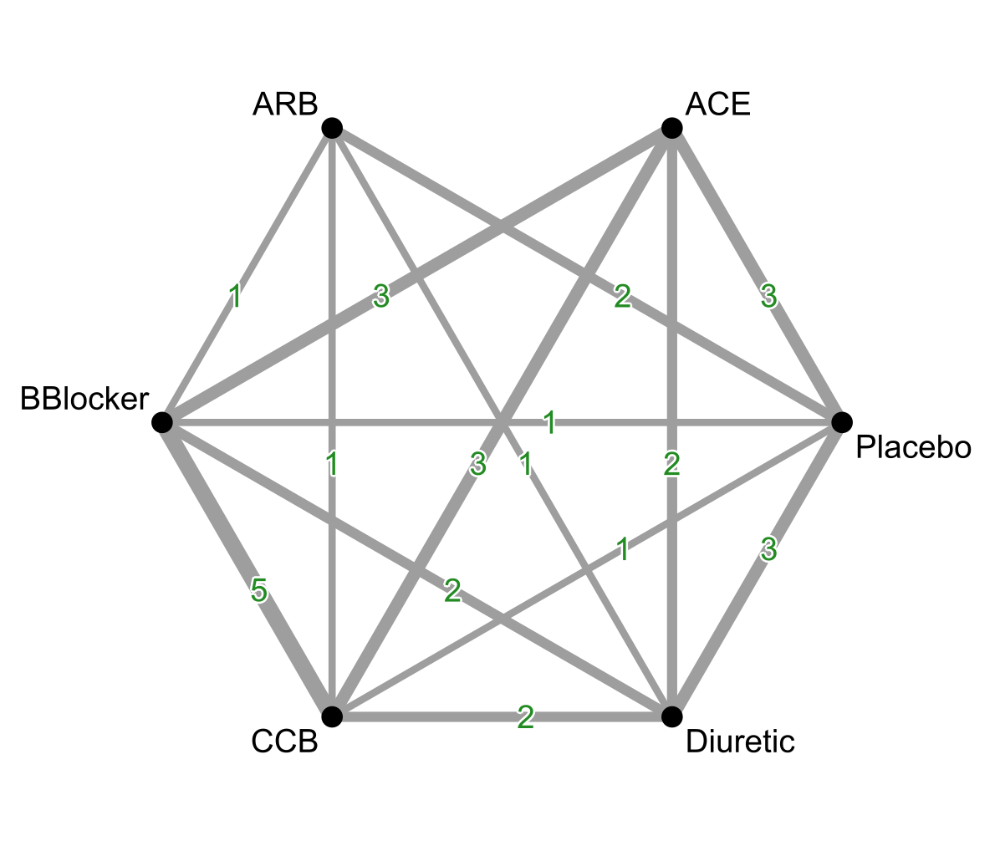
:::
::: {.column width="50%" .fragment .fade-in data-fragment-index="1"}

:::
:::

::: footer
Data from Elliot & Meyer (2007) <a href="https://doi.org/10.1016/s0140-6736(07)60108-1" target="_blank">10.1016/s0140-6736(07)60108-1</a> <br/> Ranking plot developed by Nevill *et al.* (2023) <a href="https://doi.org/10.1016/j.jclinepi.2023.02.016" target="_blank">10.1016/j.jclinepi.2023.02.016</a> 
:::

## Meta-regression evaluates the effect of covariates and the initial health of participants

::: columns
::: {.column width="50%"}
- Does the age of participants affect the outcome?
:::
::: {.column width="50%"}
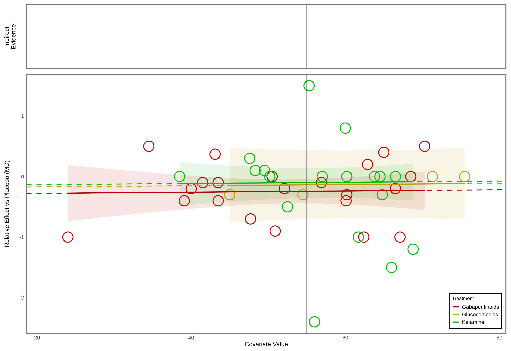
:::
::: 

::: footer
Data from Doleman *et al.* (2023) <a href="https://doi.org/10.1016/j.bja.2023.02.041" target="_blank">10.1016/j.bja.2023.02.041</a> <br/> Plot adapted from Donegan *et al.* (2018) <a href="https://doi.org/10.1016/j.jclinepi.2025.111839" target="_blank">10.1016/j.jclinepi.2025.111839</a> and developed by Morris *et al.* (2025) <a href="https://doi.org/10.1002/jrsm.1292" target="_blank">10.1002/jrsm.1292</a>
:::

## Sensitivity analyses can be run in parallel to the main analysis

::: columns
::: {.column width="50%"}
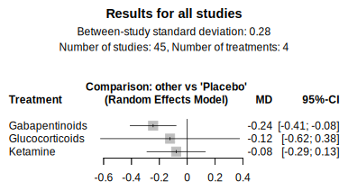
:::
::: {.column width="50%"}
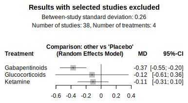
:::
::: 

::: footer
Data from Doleman *et al.* (2023) <a href="https://doi.org/10.1016/j.bja.2023.02.041" target="_blank">10.1016/j.bja.2023.02.041</a>
:::


## Complex meta-analyses require extensive statistical and programming knowledge

::: {.incremental .highlight-last}
- BUGSnet, bnma, coda, gemtc, meta, metafor, netmeta
- JAGS may be hard to install
- Require data in different formats and use different terminology
:::

## Shiny removes barriers for accessing cutting-edge methods

::: columns
::: {.column width="60%"}
- MetaInsight was developed to make NMA more accessible 
- Originally developed by statisticians, but increasingly in collaboration with developers 
:::
::: {.column width="40%"}
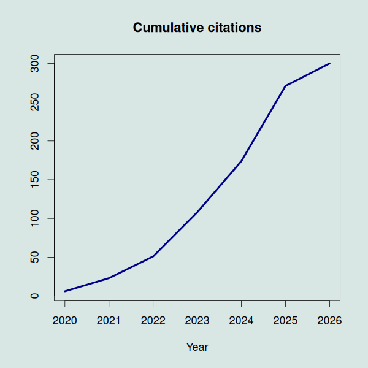
:::
:::

```{r echo = FALSE, eval = FALSE}
png("images/citations.png", 600, 600)
Year <- 2020:2026 
Citations <- c(6, 17, 28, 57, 66, 97, 29)
`Cumulative citations` <- cumsum(Citations)

par(cex = 1.5, bg = '#d8e6e4')
plot(Year, `Cumulative citations`, type = "l", col = "darkblue", lwd = 4, ylab = "", main = "Cumulative citations")
dev.off()
```

::: footer
Owen *et al.* (2019) <a href="https://doi.org/10.1002/jrsm.1373" target="_blank">10.1002/jrsm.1373</a>; Scopus (2026-03-27); Bradbury *et al.* (2025) <a href="https://doi.org/10.1186/s12874-024-02450-9" target="_blank">10.1186/s12874-024-02450-9</a>
:::

## MetaInsight has a global userbase

```{r}
library(ggplot2)
library(sf)
library(rnaturalearth)
library(rnaturalearthdata)
library(dplyr)

data <- read.csv("analytics.csv")
world <- ne_countries(scale = "medium", returnclass = "sf")

map_data <- world %>%
  left_join(data, by = c("name" = "country"))

ggplot(data = map_data) +
  geom_sf(aes(fill = count), color = "white", size = 0.2) +
  scale_fill_gradient(
    name = "Users",
    low = "#005c8a",
    high = "#e4042c",
    na.value = "grey90"
  ) +
  labs(
    caption = "Source: Google Analytics"
  ) +
  theme_void() +
  theme(
    legend.position = "right",
    plot.title = element_text(size = 16, face = "bold"),
    plot.subtitle = element_text(size = 12, color = "gray50"),
    panel.grid = element_blank()
  )
```

## The 'black box' nature of apps can limit uptake

::: columns
::: {.column width="50%"}
- Open science principles require that code can be rerun
- NICE require that NMAs are reproducible
:::

::: {.column width="50%"}

:::
:::

::: footer
<a href="https://www.nice.org.uk/guidance/ng238" target="_blank">nice.org.uk/guidance/ng238</a>; <a href="https://www.nice.org.uk/guidance/ng238/evidence/network-metaanalysis-of-changes-in-ldl-cholesterol-and-nonhdl-cholesterol-as-a-result-of-escalation-of-lipidlowering-treatment-for-secondary-prevention-of-cvd-pdf-13254044222" target="_blank"> NMA report</a> 
:::

## shinyscholar was developed to address this

::: columns
::: {.column width="70%"}
::: {.incremental .highlight-last}
- Forked from `{wallace}` to make development of reproducible apps easier
- Convert into functions and package
- App becomes interface to functions, dealing with interactivity
:::
:::
::: {.column width="30%"}

:::
:::

::: footer
Smart *et al.* (2025) <a href="https://doi.org/10.32614/CRAN.package.shinyscholar" target="_blank">10.32614/CRAN.package.shinyscholar</a>; <a href="https://simon-smart88.github.io/shinyscholar/" target="_blank">simon-smart88.github.io/shinyscholar</a>
:::

## Aims for version 7

:::{.incremental .highlight-last}
- Upload risk of bias and integrate with CiNeMA
- Improve quality and consistency of downloaded plots
- Make analyses reproducible
- Produce a downloadable report
- Maintain user experience
:::

## 

<div style="display: flex; justify-content: center; margin-top: -60px">
  
</div>

::: footer
<a href="https://crsu.shinyapps.io/MetaInsight/" target="_blank">crsu.shinyapps.io/MetaInsight</a>
:::

## 

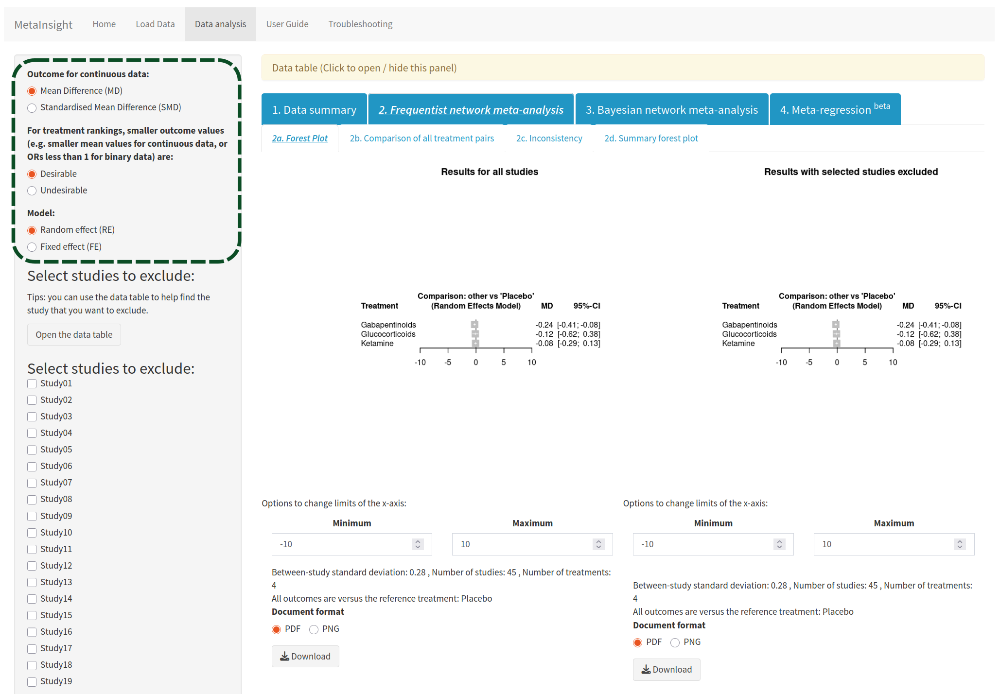

## 

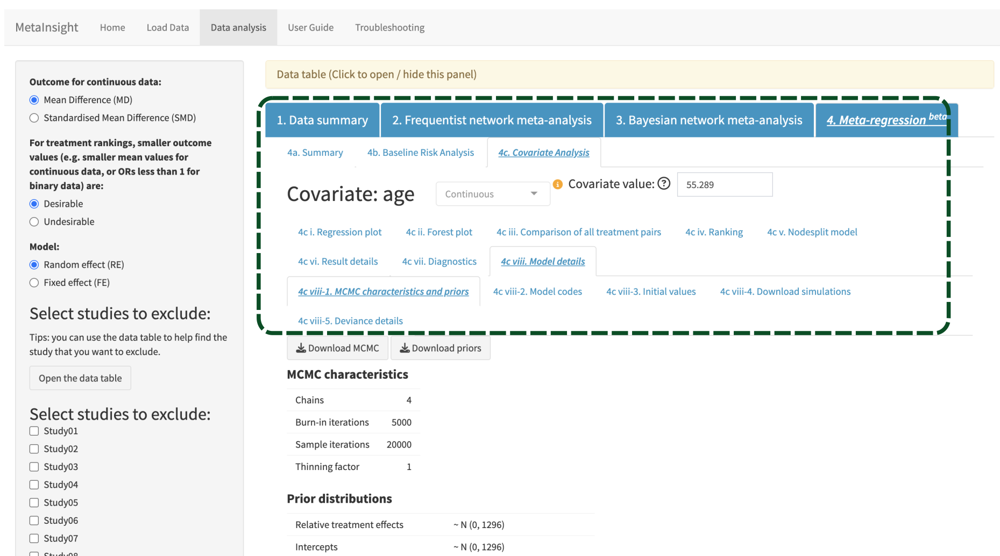

## Various adjustments were made to the shinyscholar template

:::{.incremental .highlight-last}
- Multiple parallel analyses 
- Needed to maintain the functionality of excluding studies at any point
- Once run, modules should update automatically
:::

## Incorporating risk of bias scores improves sensitivity analyses
::: columns
::: {.column width="50%" .highlight-last}
<ul>
  <li class="fragment fade-in" data-fragment-index="1">During reviews, risk of bias information can be collected e.g.</li>
  <li class="fragment fade-in" data-fragment-index="2">Randomisation, blinding, missing data</li>
  <li class="fragment fade-in" data-fragment-index="3">Scores can guide sensitivity analyses</li>
</ul>
:::

::: {.column .fragment .fade-in width="50%" data-fragment-index="4"}
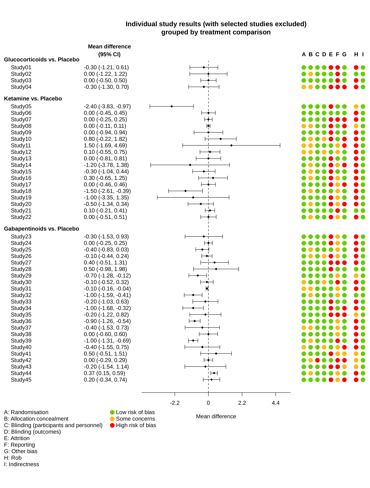
:::
:::

## Integration with CINeMA helps to evaluate confidence in findings

::: columns
::: {.column width="50%"}


- Uses risk of bias scores for *studies* to evaluate evidence for *treatments*

:::
::: {.column width="50%"}

:::
:::

::: footer
<a href="https://cinema.med.auth.gr/" target="_blank">cinema.med.auth.gr</a>;
Papakonstantinou *et al.* (2020) <a href="https://doi.org/10.1002/cl2.1080" target="_blank">10.1002/cl2.1080</a> 
:::

## Previously studies were excluded by clicking in the sidebar


## A new interface has been developed to exclude studies

- The table has been replaced with the summary forest plot but which is interactive
- Clicking on a row excludes or includes the study

::: footer

<a href="https://github.com/CRSU-Apps/MetaInsight/blob/7de87908b78d2cc3f20975afc9c8d25c164b79c5/R/setup_exclude_f.R#L86" target="_blank">Function</a>; 
<a href="https://github.com/CRSU-Apps/MetaInsight/blob/7de87908b78d2cc3f20975afc9c8d25c164b79c5/inst/shiny/www/js/exclusions.js#L1" target="_blank">Javascript</a>;
<a href="https://github.com/CRSU-Apps/MetaInsight/blob/7de87908b78d2cc3f20975afc9c8d25c164b79c5/inst/shiny/modules/setup_exclude.R#L153" target="_blank">Module</a>

:::

## Slow tasks run in the background

:::{.incremental .highlight-last}
- Fitting models can block the app for other users
- Spinner appears whilst waiting
- Can be cancelled
- Uses `shiny::ExtendedTask()` and `mirai::mirai()`
:::

::: footer
<a href="https://github.com/CRSU-Apps/MetaInsight/blob/efed9233e1c148c754a8bfefab307ba6cb58f954/inst/shiny/modules/baseline_model.R#L50" target="_blank">Example module</a>; 
<a href="https://github.com/CRSU-Apps/MetaInsight/blob/efed9233e1c148c754a8bfefab307ba6cb58f954/inst/shiny/server.R#L43" target="_blank">Loading spinner</a>;
<a href="https://rstudio.github.io/shiny/reference/ExtendedTask.html" target="_blank">`shiny::ExtendedTask()`</a>;
<a href="https://mirai.r-lib.org/" target="_blank">`{mirai}`</a>
:::

## Uploaded datasets can create difficulties

::: columns
::: {.column width="50%" .highlight-last}
<ul>
  <li class="fragment fade-in" data-fragment-index="1">Contain errors which could crash the app</li>
  <li class="fragment fade-in" data-fragment-index="2">Number of studies and treatments can vary</li>
  <li class="fragment fade-in" data-fragment-index="3">Treatment and study names can vary in length</li>
</ul>
:::

::: {.column .fragment .fade-in width="50%" data-fragment-index="4"}
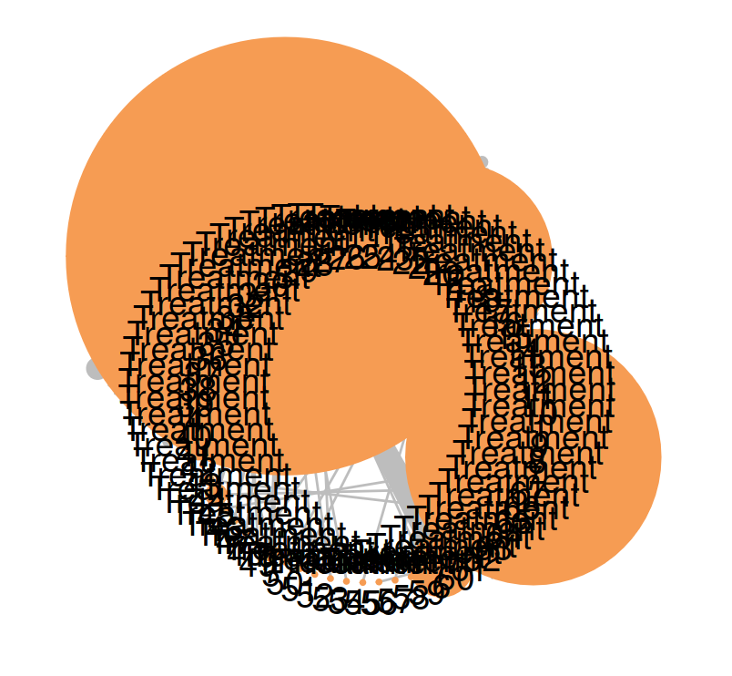
:::
:::


## Producing publication-ready figures

:::{.incremental .highlight-last}
- Ideally plots can be downloaded and used without editing
- Reuse plots from other packages, others custom-built
- Mixture of base plots, grid and ggplot2
:::

## 


## 


## 

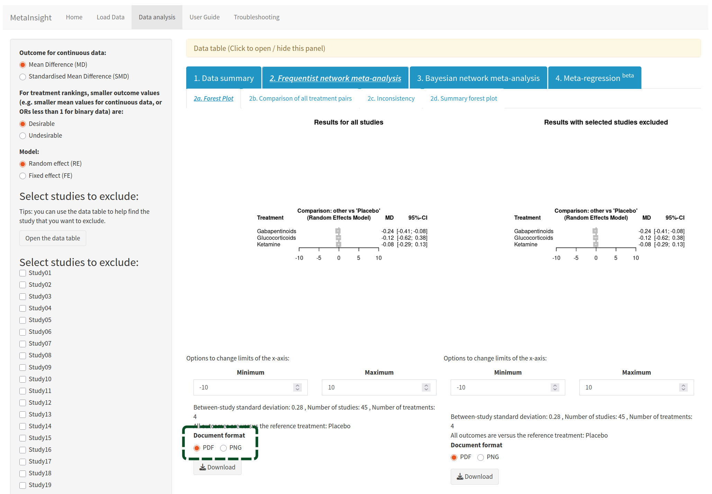

##

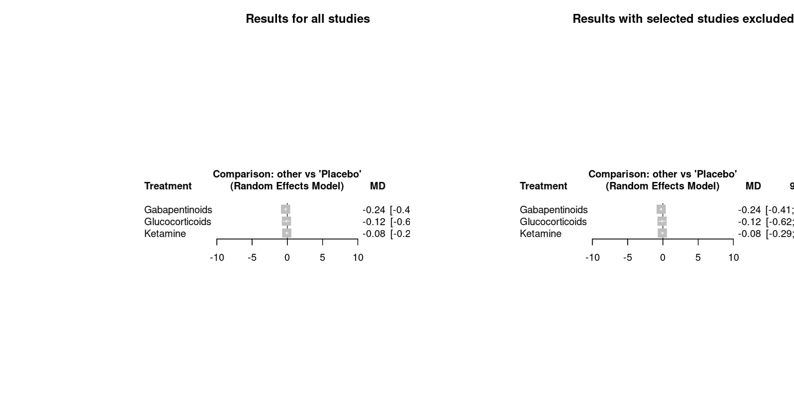

## Some downloaded plots had wide margins and low resolution

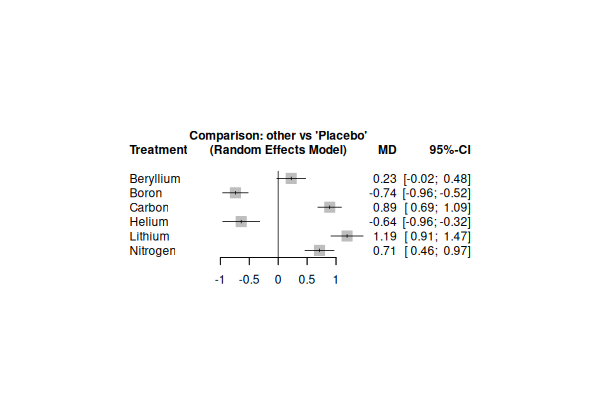

## Adjusting plots to always fit is challenging

::: {.incremental .highlight-last}
- Dimensions need to be adjusted depending on dataset
- Space available to display depends on screen size
- Information in plot margins takes up a fixed number of pixels
:::

## Plots are now all produced using a consistent workflow

::: {.incremental .highlight-last}
- Functions generate SVGs 
- In app they squash and stretch freely
- Enables fullscreen viewing
- Can all be rendered to png, pdf or saved as svg
- Enables testing of reproducibility
:::

::: footer

<a href="https://simon-smart88.github.io/forest_plot_blog/forest_blog.html" target="_blank">Interactive blog</a>; 
<a href="https://github.com/CRSU-Apps/MetaInsight/blob/7de87908b78d2cc3f20975afc9c8d25c164b79c5/R/summary_network_f.R#L1" target="_blank">Example function</a>; 
<a href="https://github.com/CRSU-Apps/MetaInsight/blob/efed9233e1c148c754a8bfefab307ba6cb58f954/R/helper_functions.R#L327" target="_blank">`crop_svg()`</a>; 
<a href="https://github.com/CRSU-Apps/MetaInsight/blob/efed9233e1c148c754a8bfefab307ba6cb58f954/inst/shiny/www/css/styles.css#L200" target="_blank">CSS</a>; 
<a href="https://github.com/CRSU-Apps/MetaInsight/blob/efed9233e1c148c754a8bfefab307ba6cb58f954/inst/shiny/ui_helpers.R#L210" target="_blank">Container</a>; 
<a href="https://github.com/CRSU-Apps/MetaInsight/blob/efed9233e1c148c754a8bfefab307ba6cb58f954/R/helper_functions.R#L177" target="_blank">`write_plot()`</a>; 
<a href="https://github.com/CRSU-Apps/MetaInsight/blob/efed9233e1c148c754a8bfefab307ba6cb58f954/tests/testthat/test-rep_markdown.R#L197" target="_blank">Example test</a>

:::

## Reproducibility relies on a strict structure

::: {.incremental .highlight-last}
- Each module has an id made up of the component and module `summary_network`
- Each calls a synonymous function `summary_network()`
- Input values are stored in `common$meta$summary_network$<input id>`
- Values are knitted into an .Rmd chunk and combined to create a .qmd
:::

::: footer

<a href="https://github.com/CRSU-Apps/MetaInsight/blob/efed9233e1c148c754a8bfefab307ba6cb58f954/inst/shiny/modules/summary_network.R#L48" target="_blank">Storing inputs</a>; 
<a href="https://github.com/CRSU-Apps/MetaInsight/blob/efed9233e1c148c754a8bfefab307ba6cb58f954/inst/shiny/modules/summary_network.R#L178" target="_blank">Passing values</a>; <a href="https://github.com/CRSU-Apps/MetaInsight/blob/4b385052e7ad2c5b0af99a4c9e88a0e55e395be1/inst/shiny/modules/summary_network.Rmd#L1" target="_blank">module `.Rmd`</a>;
<a href="https://simon-smart88.github.io/shinyscholar/reference/metadata.html" target="_blank">Semi-automated by `shinyscholar::metadata()`</a>
:::

## Reproducibility relies on a strict structure {.mediumcode}

::: {.fragment .fade-in}
````markdown
```{{asis, echo = {{summary_network_knit}}, eval = {{summary_network_knit}}, include = {{summary_network_knit}}}}
### Display the networks for the original data and data with excluded studies.
```
```{{r, echo = {{summary_network_knit}}, include = {{summary_network_knit}}}}
summary_network(configured_data,
                {{summary_network_style}}, 
                {{summary_network_label_all}}, 
                "Network plot of all studies")
```
````
:::

::: {.fragment .fade-in}

````markdown
### Display the networks for the original data and data with excluded studies.

```{{r}}
summary_network(configured_data, 
                "netplot", 
                1, 
                "Network plot of all studies")
```
````
:::

## Reproducibility also enables improved reporting
::: columns
::: {.column width="50%"}
- Use as the basis for writing a publication
- Rendered in the app to produce an html report
:::
::: {.column style="margin-top: -80px;"}
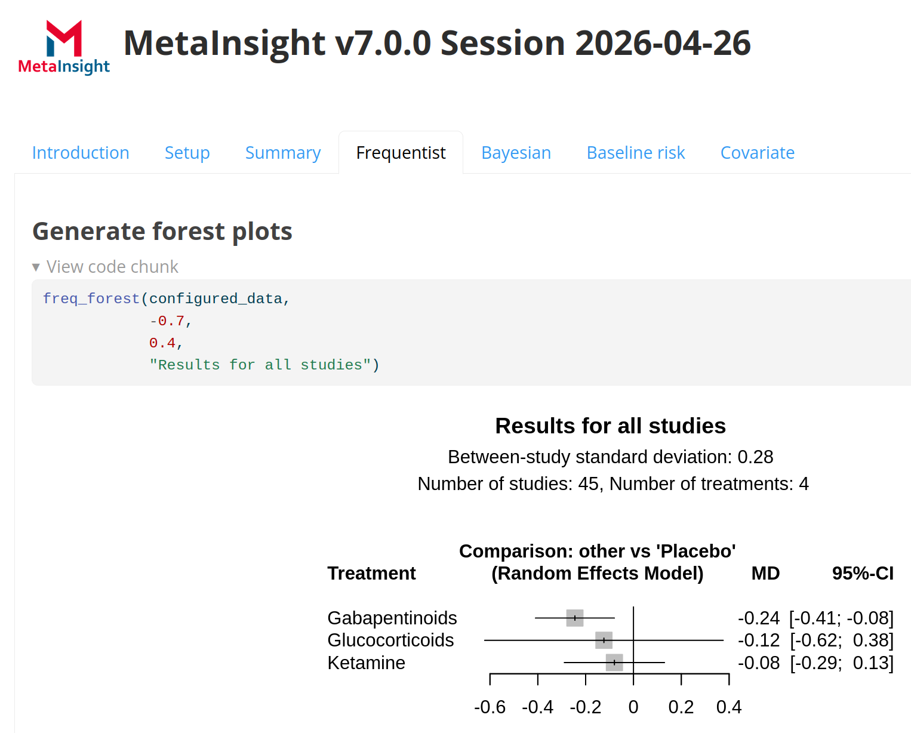
:::
:::

::: footer
<a href="https://github.com/CRSU-Apps/MetaInsight/blob/efed9233e1c148c754a8bfefab307ba6cb58f954/inst/shiny/modules/rep_markdown.R" target="_blank">`rep_markdown` module</a>
:::

## Analyses can also be saved to a file

:::{.incremental .highlight-last}
- Can be restored later on
- Share with colleagues 
- Access the data / models for further analysis
- Potential to spin up exact version of app in the future
:::

::: footer
<a href="https://github.com/CRSU-Apps/MetaInsight/blob/efed9233e1c148c754a8bfefab307ba6cb58f954/inst/shiny/modules/core_save.R" target="_blank">Saving</a>; 
<a href="https://github.com/CRSU-Apps/MetaInsight/blob/efed9233e1c148c754a8bfefab307ba6cb58f954/inst/shiny/modules/setup_reload.R" target="_blank">Reloading</a>; <a href="https://simon-smart88.github.io/shinyscholar/reference/save_and_load.html" target="_blank">automated by `shinyscholar::save_and_load()`</a>
:::


## The app can also be run locally {.largecode}

```{r eval = FALSE, echo = TRUE}
install.packages("metainsight")
library(metainsight)
run_metainsight()

run_metainsight(load_file = "saved_file.rds")
```

## Analyses can also be conducted without the app {.mediumcode}

```{r eval = FALSE, echo = TRUE}
configured_data <- setup_load("my_data.csv", outcome = "continuous") |>
  setup_configure(reference_treatment = "Placebo",
                  effects = "random",
                  outcome_measure = "MD",
                  ranking_option = "good",
                  seed = 123)
```

## Analyses can also be conducted without the app {.mediumcode}

```{r eval = FALSE, echo = TRUE}
freq_forest(configured_data) |> 
  write_plot("frequentist_forest_plot.pdf")

bayes_model(configured_data) |> 
  bayes_forest() |>
  write_plot("bayesian_forest_plot.pdf")
```

- Explained further in vignette

## User feedback is important for developing new features


- <a href="https://crsu.shinyapps.io/MetaInsight_Scholar/" target="_blank">crsu.shinyapps.io/MetaInsight_Scholar</a>
- <a href="https://github.com/CRSU-Apps/MetaInsight/issues" target="_blank">Open an issue</a> or <a href="mailto: apps@crsu.org.uk" target="_blank">send an email</a>

## Acknowledgments {.mediumtext}

::: columns
::: {.column width="70%"}
- Naomi Bradbury, Ryan Field, Tom Morris, Clareece Nevill, Janion Nevill, Alex Sutton, Nicola Cooper, Suzanne Freeman
- Wellcome (via Chan Zuckerburg Initiative)
- NIHR
- <a href="mailto:ss1545@le.ac.uk">Email</a>, <a href="https://github.com/simon-smart88" target="_blank">Github</a>, <a href="https://bsky.app/profile/simonsmart.bsky.social" target="_blank">Bluesky</a>
:::
::: {.column width="30%"}
<div> 


</div>
:::
:::

::: footer
<a href="https://github.com/simon-smart88/metainsight_rmedicine" target="_blank">Slides</a>
:::
